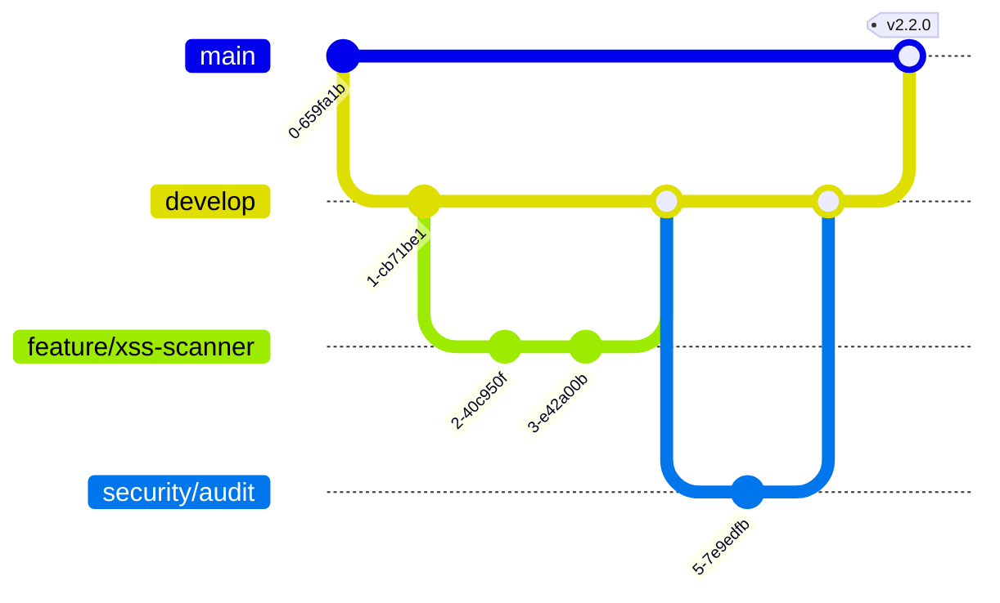

# 🔀 Git Workflow Guide for CAYC BAKE Framework

## 📋 Table of Contents
1. [Recommended Workflow](#recommended-workflow)
2. [Branch Strategy](#branch-strategy)
3. [Commit Conventions](#commit-conventions)
4. [Security Considerations](#security-considerations)
5. [Automation & CI/CD](#automation--cicd)
6. [Team Collaboration](#team-collaboration)

---

## 🎯 Recommended Workflow

### **GitFlow with Security Extensions**

Given CAYC BAKE is a security framework with potentially sensitive code, I recommend a modified GitFlow approach with additional security branches:



---

## 🌳 Branch Strategy

### **Primary Branches**

```yaml
main:
  - Production-ready code
  - Protected branch
  - Requires PR + review
  - Tagged releases only
  - Security audited

develop:
  - Integration branch
  - Latest development
  - Feature merges here first
  - Nightly builds

security:
  - Security patches
  - Vulnerability fixes
  - Fast-track to main
  - Requires security review
```

### **Supporting Branches**

```bash
# Feature Branches
feature/tool-name       # New security tools
feature/scanner-update  # Scanner improvements
feature/payload-gen     # Payload generators

# Bugfix Branches
bugfix/false-positive   # Fix detection issues
bugfix/install-error    # Installation fixes

# Security Branches
security/cve-fix        # CVE patches
security/dep-update     # Dependency updates

# Experimental Branches
experiment/ai-fuzzing   # Experimental features
experiment/cloud-enum   # New attack vectors

# Release Branches
release/v2.2.0         # Release preparation
hotfix/v2.2.1          # Emergency fixes
```

---

## 📝 Commit Conventions

### **Conventional Commits Format**

```bash
<type>(<scope>): <subject>

<body>

<footer>
```

### **Types for Security Projects**

```bash
# Core Types
feat:     New feature or tool
fix:      Bug fix
docs:     Documentation
test:     Test cases
refactor: Code refactoring
perf:     Performance improvement

# Security Specific
vuln:     Vulnerability fix
payload:  New payload/exploit
scanner:  Scanner updates
tool:     Tool addition/update
defense:  Defense mechanism
audit:    Security audit finding
```

### **Examples**

```bash
# Good Commits
feat(xss): add DOM-based XSS detection module
vuln(sqli): patch SQL injection in API fuzzer
tool(nmap): integrate nmap service detection
payload(csrf): add advanced CSRF token extractor
docs(install): update WSL installation guide

# Commit with Body
scanner(s3): improve bucket enumeration speed

- Added concurrent scanning with goroutines
- Implemented rate limiting to avoid detection
- Added support for GCP buckets
- Performance: 10x faster than v2.1

Fixes #45
```

---

## 🔒 Security Considerations

### **Sensitive Data Protection**

```yaml
Pre-commit Hooks:
  - secret-scan       # Scan for API keys
  - credential-check  # Check for passwords
  - pii-detection    # Personal info check
  
Protected Files:
  - .env files       # Never commit
  - api_keys.json    # Use .gitignore
  - credentials/*    # Exclude folder
  
Security Reviews:
  - All PRs to main require security review
  - Automated SAST scanning
  - Dependency vulnerability checks
```

### **.gitsecrets Configuration**

```bash
# Install git-secrets
git secrets --install
git secrets --register-aws

# Add custom patterns
git secrets --add 'api[_-]?key.*[:=].*'
git secrets --add 'password.*[:=].*'
git secrets --add 'token.*[:=].*'

# Scan repository
git secrets --scan
```

---

## 🤖 Automation & CI/CD

### **GitHub Actions Workflow**

```yaml
name: CAYC BAKE CI/CD

on:
  push:
    branches: [main, develop]
  pull_request:
    branches: [main]

jobs:
  security-scan:
    runs-on: ubuntu-latest
    steps:
      - uses: actions/checkout@v3
      
      # Secret Scanning
      - name: TruffleHog Secret Scan
        uses: trufflesecurity/trufflehog@main
        with:
          path: ./
          
      # SAST Scanning
      - name: Semgrep
        uses: returntocorp/semgrep-action@v1
        
      # Dependency Check
      - name: Dependency Check
        uses: dependency-check/Dependency-Check_Action@main
        
  test-suite:
    runs-on: ubuntu-latest
    strategy:
      matrix:
        os: [ubuntu-latest, windows-latest, macos-latest]
        python: [3.8, 3.9, 3.10, 3.11]
    steps:
      - uses: actions/checkout@v3
      - name: Setup Python
        uses: actions/setup-python@v4
        with:
          python-version: ${{ matrix.python }}
      - name: Install Dependencies
        run: |
          pip install -r requirements.txt
      - name: Run Tests
        run: |
          pytest tests/
          
  installer-test:
    runs-on: ${{ matrix.os }}
    strategy:
      matrix:
        os: [ubuntu-latest, windows-latest, macos-latest]
    steps:
      - uses: actions/checkout@v3
      - name: Test Installer
        run: |
          if [[ "$RUNNER_OS" == "Windows" ]]; then
            pwsh -File install.ps1 -SkipPrompts -Minimal
          else
            bash install.sh --skip-prompts --minimal
          fi
```

### **Pre-commit Hooks**

```yaml
# .pre-commit-config.yaml
repos:
  - repo: https://github.com/pre-commit/pre-commit-hooks
    rev: v4.4.0
    hooks:
      - id: trailing-whitespace
      - id: end-of-file-fixer
      - id: check-yaml
      - id: check-added-large-files
        args: ['--maxkb=1000']
      - id: check-merge-conflict
      
  - repo: https://github.com/psf/black
    rev: 23.7.0
    hooks:
      - id: black
        language_version: python3
        
  - repo: https://github.com/Yelp/detect-secrets
    rev: v1.4.0
    hooks:
      - id: detect-secrets
        args: ['--baseline', '.secrets.baseline']
        
  - repo: https://github.com/PyCQA/bandit
    rev: 1.7.5
    hooks:
      - id: bandit
        args: ['-ll', '-r', '.']
```

---

## 👥 Team Collaboration

### **Pull Request Template**

```markdown
## 🎯 PR Type
- [ ] Feature
- [ ] Bug Fix
- [ ] Security Patch
- [ ] Tool Addition
- [ ] Documentation

## 📝 Description
Brief description of changes

## 🔒 Security Impact
- [ ] No security impact
- [ ] Security improvement
- [ ] Requires security review

## ✅ Checklist
- [ ] Code follows style guidelines
- [ ] Self-review completed
- [ ] Tests pass locally
- [ ] Documentation updated
- [ ] No secrets exposed
- [ ] Installers still work

## 🧪 Testing
- [ ] Tested on Linux
- [ ] Tested on Windows
- [ ] Tested on macOS
- [ ] Tested in Docker

## 📸 Screenshots
If applicable, add screenshots
```

### **Issue Templates**

```yaml
# .github/ISSUE_TEMPLATE/bug_report.yml
name: Bug Report
description: Report a bug in CAYC BAKE
title: "[BUG] "
labels: ["bug", "triage"]
body:
  - type: dropdown
    id: component
    attributes:
      label: Component
      options:
        - Installer
        - Scanner
        - XSS Module
        - API Fuzzer
        - Documentation
        - Other
        
  - type: textarea
    id: description
    attributes:
      label: Bug Description
      description: Clear description of the bug
      
  - type: textarea
    id: reproduce
    attributes:
      label: Steps to Reproduce
      value: |
        1. 
        2. 
        3. 
        
  - type: dropdown
    id: os
    attributes:
      label: Operating System
      options:
        - Windows
        - Linux
        - macOS
        - WSL
```

---

## 🚀 Release Workflow

### **Semantic Versioning**

```bash
MAJOR.MINOR.PATCH

# Examples
2.0.0 -> 3.0.0  # Breaking changes
2.0.0 -> 2.1.0  # New features
2.0.0 -> 2.0.1  # Bug fixes
```

### **Release Process**

```bash
# 1. Create release branch
git checkout -b release/v2.2.0 develop

# 2. Version bump
# Update version in:
# - README.md
# - install.ps1
# - install.sh
# - requirements.txt

# 3. Update CHANGELOG
echo "## v2.2.0 - $(date +%Y-%m-%d)" >> CHANGELOG.md

# 4. Commit changes
git commit -am "chore: bump version to v2.2.0"

# 5. Merge to main
git checkout main
git merge --no-ff release/v2.2.0

# 6. Tag release
git tag -a v2.2.0 -m "Release v2.2.0: Feature Name"

# 7. Merge back to develop
git checkout develop
git merge --no-ff release/v2.2.0

# 8. Push everything
git push origin main develop --tags

# 9. Create GitHub Release
gh release create v2.2.0 \
  --title "CAYC BAKE v2.2.0" \
  --notes-file RELEASE_NOTES.md \
  --draft
```

---

## 📊 Workflow Comparison

| Workflow | Pros | Cons | Best For |
|----------|------|------|----------|
| **GitFlow** | Clear structure, stable releases | Complex for small teams | This project ✅ |
| **GitHub Flow** | Simple, continuous deployment | Less structure | Small tools |
| **GitLab Flow** | Environment branches | Overhead | Enterprise |
| **Trunk-Based** | Fast integration | Requires discipline | Experienced teams |

---

## 🎯 Recommended Setup for CAYC BAKE

```bash
# Initial Setup
git config --global user.name "Your Name"
git config --global user.email "you@example.com"

# Configure branch protection (on GitHub)
# main branch:
# - Require PR reviews (2 reviewers)
# - Require status checks
# - Include administrators
# - Require up-to-date branches

# develop branch:
# - Require PR reviews (1 reviewer)
# - Require status checks

# Set up aliases for common workflows
git config --global alias.feature "checkout -b feature/"
git config --global alias.bugfix "checkout -b bugfix/"
git config --global alias.security "checkout -b security/"

# Useful aliases
git config --global alias.graph "log --graph --pretty=format:'%Cred%h%Creset -%C(yellow)%d%Creset %s %Cgreen(%cr) %C(bold blue)<%an>%Creset' --abbrev-commit"
git config --global alias.unstage "reset HEAD --"
git config --global alias.last "log -1 HEAD"
```

---

## 📚 Additional Resources

- [Git Documentation](https://git-scm.com/doc)
- [GitHub Flow Guide](https://guides.github.com/introduction/flow/)
- [Conventional Commits](https://www.conventionalcommits.org/)
- [Git Secrets](https://github.com/awslabs/git-secrets)
- [Pre-commit Hooks](https://pre-commit.com/)

---

🍰 **Remember**: Security tools require extra care in version control. Always scan for secrets before committing! 🔒
